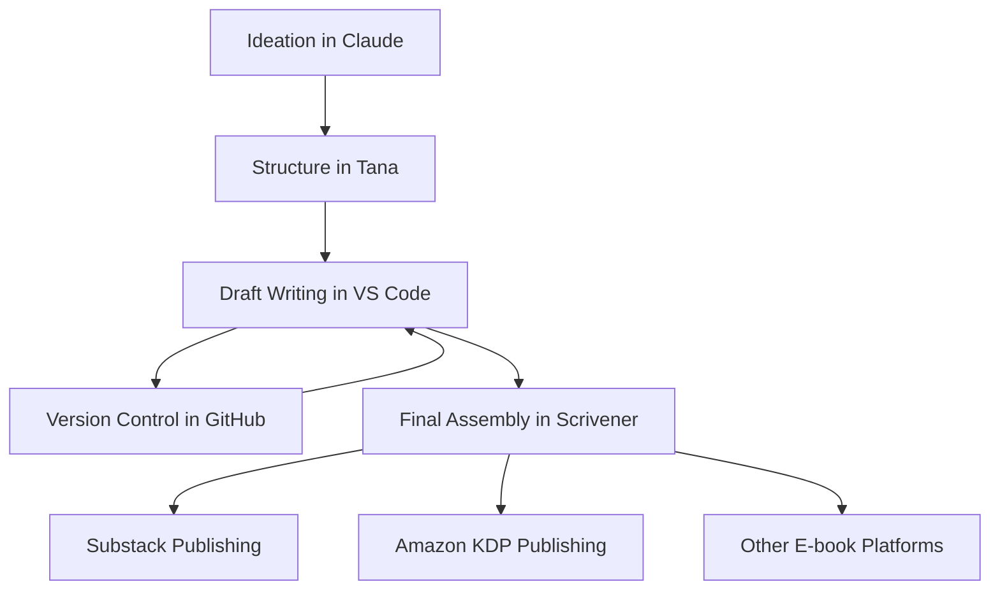

# Comprehensive Self-Publishing Workflow Setup Guide

This guide provides detailed instructions for implementing a complete book publishing workflow using Claude, GitHub, Tana, VS Code, and Scrivener, optimized for self-publishing on Substack, Amazon KDP, and other e-book platforms.

## Table of Contents
- [Tool Acquisition](#tool-acquisition)
- [Overall Workflow](#overall-workflow)
- [Claude Configuration](#claude-configuration)
- [GitHub Setup](#github-setup)
- [Tana Configuration](#tana-configuration)
- [VS Code Setup](#vs-code-setup)
- [Scrivener Configuration](#scrivener-configuration)
- [Integration Process](#integration-process)
- [Publishing Workflow](#publishing-workflow)

## Tool Acquisition

### Required Purchases
1. **Tana**: $10/month for Pro Plan at [tana.inc](https://tana.inc)
2. **Scrivener**: $49 (one-time purchase) at [literatureandlatte.com](https://www.literatureandlatte.com/scrivener/overview)
3. **GitHub**: Free for public repositories; $4/month for private repositories at [github.com](https://github.com)
4. **VS Code**: Free at [code.visualstudio.com](https://code.visualstudio.com)
5. **Claude**: Free for basic use, premium plans available at [anthropic.com](https://www.anthropic.com)

### Optional but Recommended
1. **Calibre**: Free e-book management at [calibre-ebook.com](https://calibre-ebook.com)
2. **Grammarly**: $12/month for premium writing assistance at [grammarly.com](https://www.grammarly.com)
3. **Amazon KDP Account**: Free at [kdp.amazon.com](https://kdp.amazon.com)
4. **Substack Account**: Free at [substack.com](https://substack.com)

## Overall Workflow



## Claude Configuration

### Setting Up Effective Prompts

1. **Create template prompts for different writing tasks**:

```
# Chapter Development Template

Context: MAGA Christianism project, developing Chapter [X]: [Title]

Previous context: [Brief summary of previous chapter]

## Current chapter outline:
[Paste outline from Tana]

## Request:
Please develop section [X.X] based on the outline. Focus on [specific aspect] and incorporate insights from [specific sources]. The tone should be [academic/accessible/narrative] and aimed at [target audience].

## Specific elements to include:
- [Key point 1]
- [Key point 2]
- [Reference to source X]
- [Connection to previous chapter Y]
```

2. **Set up a prompt for critique and refinement**:

```
# Content Refinement Template

## Original content:
[Paste content to be refined]

## Refinement goals:
1. Improve clarity of theological arguments
2. Ensure accessibility for educated non-theologians
3. Strengthen connections to the primary sources
4. Maintain consistent voice and tone

Please provide a refined version of this content, focusing on these goals. Highlight any substantial changes or suggestions in [brackets].
```

3. **Configure Claude to output in proper markdown format**:

```
Please format your response using proper markdown formatting:
- Use # for main headings, ## for subheadings, etc.
- Use *italic* and **bold** for emphasis
- Use > for blockquotes
- Use proper markdown list formatting
- Use --- for section breaks
- Include YAML frontmatter at the top of the document
```

### Integration with VS Code

1. Install the "Claude for VS Code" extension from the marketplace
2. Configure API key in extension settings
3. Use keyboard shortcut (Ctrl+Shift+I) to send highlighted text to Claude

## GitHub Setup

### Repository Configuration

1. **Create a new repository**:
   - Go to GitHub and create a new repository named "maga-christianism-book"
   - Initialize with README.md
   - Choose private repository if desired

2. **Set up branch protection rules**:
   - Go to Settings → Branches → Add rule
   - Set "main" as protected branch
   - Require pull request reviews before merging
   - Require status checks to pass before merging

3. **Create essential folders**:
   ```
   /chapters
   /research
   /outlines
   /assets
   /drafts
   /publishing
   ```

4. **Set up .gitignore file**:
   Create a `.gitignore` file with the following content:
   ```
   # OS files
   .DS_Store
   Thumbs.db

   # Scrivener backup files
   *.scrivx~
   *.backup

   # Tana export temp files
   *.tmp

   # VS Code workspace files
   .vscode/*
   !.vscode/settings.json
   !.vscode/extensions.json

   # Build outputs
   /output/
   *.epub
   *.mobi
   *.pdf
   ```

5. **Create branch strategy**:
   - `main` - stable, reviewed content
   - `draft/chapter-X` - working drafts for each chapter
   - `research/topic-X` - research notes and materials

### GitHub Actions for Automation

Create a workflow file at `.github/workflows/markdown-processing.yml`:

```yaml
name: Markdown Processing

on:
  push:
    branches: [ main ]
    paths:
      - 'chapters/**'
      - 'outlines/**'

jobs:
  process-markdown:
    runs-on: ubuntu-latest
    steps:
      - uses: actions/checkout@v2
      
      - name: Set up Node.js
        uses: actions/setup-node@v2
        with:
          node-version: '16'
          
      - name: Install dependencies
        run: npm install -g markdownlint-cli
        
      - name: Lint Markdown files
        run: markdownlint 'chapters/**/*.md' 'outlines/**/*.md'
        
      - name: Generate TOC
        run: |
          npm install -g markdown-toc
          for file in chapters/*.md; do
            markdown-toc -i "$file"
          done
          
      - name: Commit changes
        uses: stefanzweifel/git-auto-commit-action@v4
        with:
          commit_message: "Auto-update TOC and fix markdown formatting"
```

## Tana Configuration

### Super Tags (Schema)

Create the following Super Tags in Tana:

1. **#Book**
   - Properties:
     - `title`: Text
     - `subtitle`: Text
     - `status`: Select [Outline, Draft, Review, Final]
     - `description`: Text
     - `targetAudience`: Text
     - `marketingDescription`: Text
     - `publishPlatforms`: Multi-select [Amazon, Substack, Apple Books, Kobo]

2. **#Chapter**
   - Properties:
     - `title`: Text
     - `number`: Number
     - `status`: Select [Outline, Draft, Review, Final]
     - `wordCount`: Number
     - `targetWordCount`: Number
     - `keyPoints`: Multi-line Text
     - `part`: Select [Part I, Part II, Part III, Part IV]
     - `publishedOnSubstack`: Date
     - `draftCompletedDate`: Date

3. **#Section**
   - Properties:
     - `title`: Text
     - `status`: Select [Outline, Draft, Review, Final]
     - `wordCount`: Number
     - `targetWordCount`: Number
     - `keyPoints`: Multi-line Text
     - `sources`: Reference []
     - `quotes`: Multi-line Text

4. **#Source**
   - Properties:
     - `title`: Text
     - `author`: Text
     - `type`: Select [Book, Article, Video, Interview, Document, Podcast]
     - `notes`: Multi-line Text
     - `relevantPages`: Text
     - `keyInsights`: Multi-line Text
     - `category`: Multi-select [Primitive Biblicism, Practical Atheism, Binary Apocalypticism, Theological Foundations]

5. **#Quote**
   - Properties:
     - `text`: Multi-line Text
     - `source`: Reference #Source
     - `page`: Text
     - `relevantTo`: Reference [#Chapter, #Section]
     - `category`: Multi-select [Primitive Biblicism, Practical Atheism, Binary Apocalypticism, Theological Foundations]

6. **#Task**
   - Properties:
     - `description`: Text
     - `status`: Select [Not Started, In Progress, Waiting, Completed]
     - `dueDate`: Date
     - `priority`: Select [Low, Medium, High, Urgent]
     - `relatedTo`: Reference [#Chapter, #Section, #Source]

### Tana Views

1. **Book Overview**
   - Create a view showing all chapters by part
   - Include status and completion percentages
   - Group by part

2. **Writing Dashboard**
   - Show current chapters in progress
   - Display word count goals and progress
   - Show upcoming tasks and deadlines

3. **Source Database**
   - List all sources with filtering options
   - Group by category
   - Show related chapters and sections

4. **Publishing Queue**
   - Track which chapters are ready for Substack
   - Monitor publishing schedule
   - Track status of KDP preparation

### Tana Export Configuration

Create a template for exporting to markdown:

```
# {{node.title}}

{{#if node.description}}{{node.description}}{{/if}}

{{#each children}}
## {{this.title}}

{{#if this.keyPoints}}{{this.keyPoints}}{{/if}}

{{#each this.children}}
### {{this.title}}

{{#if this.keyPoints}}{{this.keyPoints}}{{/if}}

{{#each this.children}}
#### {{this.title}}

{{this.notes}}

{{/each}}
{{/each}}
{{/each}}
```

## VS Code Setup

### Extensions to Install

1. **Markdown and Writing**:
   - Markdown All in One
   - markdownlint
   - Markdown Preview Enhanced
   - Markdown Table Formatter
   - Code Spell Checker
   - Word Count

2. **Git Integration**:
   - GitLens
   - GitHub Pull Requests and Issues

3. **Productivity**:
   - Todo Tree
   - Bookmarks
   - Project Manager

4. **Formatting and Theming**:
   - Prettier
   - One Dark Pro (or your preferred theme)
   - Material Icon Theme

5. **Specialized for Your Project**:
   - YAML
   - Better TOML
   - Mermaid Markdown Syntax Highlighting

### Workspace Configuration

Create a `.vscode/settings.json` file with the following content:

```json
{
  "editor.wordWrap": "on",
  "editor.formatOnSave": true,
  "editor.defaultFormatter": "esbenp.prettier-vscode",
  "editor.rulers": [100],
  "files.autoSave": "afterDelay",
  "files.autoSaveDelay": 1000,
  
  "[markdown]": {
    "editor.defaultFormatter": "yzhang.markdown-all-in-one",
    "editor.wordWrap": "on",
    "editor.quickSuggestions": {
      "comments": "on",
      "strings": "on",
      "other": "on"
    }
  },
  
  "markdown.extension.toc.levels": "2..4",
  "markdown.extension.toc.updateOnSave": true,
  "markdown.extension.preview.breaks": true,
  
  "git.enableSmartCommit": true,
  "git.confirmSync": false,
  "git.autofetch": true,
  
  "workbench.editor.enablePreview": false,
  "workbench.colorCustomizations": {
    "editorRuler.foreground": "#5a5a5a"
  },
  
  "cSpell.words": [
    "biblicism",
    "Christianism",
    "MAGA",
    "Niebuhr",
    "Substack"
  ],
  
  "todo-tree.general.tags": [
    "TODO",
    "FIXME",
    "RESEARCH",
    "CITE",
    "EXPAND",
    "REVISE"
  ],
  "todo-tree.highlights.customHighlight": {
    "RESEARCH": {
      "icon": "beaker",
      "foreground": "#fff",
      "background": "#b58900"
    },
    "CITE": {
      "icon": "book",
      "foreground": "#fff",
      "background": "#6c71c4"
    },
    "EXPAND": {
      "icon": "unfold",
      "foreground": "#fff",
      "background": "#2aa198"
    },
    "REVISE": {
      "icon": "pencil",
      "foreground": "#fff",
      "background": "#cb4b16"
    }
  }
}
```

### Snippets for Book Writing

Create a file at `.vscode/markdown.code-snippets`:

```json
{
  "Chapter Header": {
    "prefix": "chapter",
    "body": [
      "---",
      "title: \"Chapter ${1:number}: ${2:title}\"",
      "part: \"${3|Part I: Foundations,Part II: Primitive Biblicism,Part III: Practical Atheism,Part IV: Binary Apocalypticism|}\"",
      "status: \"${4|Draft,Review,Final|}\"",
      "created: \"$CURRENT_YEAR-$CURRENT_MONTH-$CURRENT_DATE\"",
      "updated: \"$CURRENT_YEAR-$CURRENT_MONTH-$CURRENT_DATE\"",
      "---",
      "",
      "# Chapter ${1}: ${2}",
      "",
      "## Introduction",
      "",
      "${5:introduction text}",
      "",
      "## ${6:First Section}",
      "",
      "${7:section content}",
      "",
      "## ${8:Second Section}",
      "",
      "${9:section content}",
      "",
      "## Conclusion",
      "",
      "${10:conclusion text}"
    ],
    "description": "Insert chapter template with YAML frontmatter"
  },
  
  "Section Header": {
    "prefix": "section",
    "body": [
      "## ${1:Section Title}",
      "",
      "${2:section content}"
    ],
    "description": "Insert section heading"
  },
  
  "Subsection Header": {
    "prefix": "subsection",
    "body": [
      "### ${1:Subsection Title}",
      "",
      "${2:subsection content}"
    ],
    "description": "Insert subsection heading"
  },
  
  "Blockquote": {
    "prefix": "quote",
    "body": [
      "> ${1:quote text}",
      ">",
      "> — ${2:author}, *${3:source}*"
    ],
    "description": "Insert formatted blockquote with attribution"
  },
  
  "Source Reference": {
    "prefix": "source",
    "body": [
      "<!-- SOURCE: ${1:title} by ${2:author} -->",
      "${3:content referencing the source}"
    ],
    "description": "Insert source reference comment"
  },
  
  "TODO Comment": {
    "prefix": "todo",
    "body": [
      "<!-- TODO: ${1:description} -->"
    ],
    "description": "Insert TODO comment"
  },
  
  "YAML Frontmatter": {
    "prefix": "yaml",
    "body": [
      "---",
      "title: \"${1:Title}\"",
      "author: \"Craig Uffman\"",
      "date: \"$CURRENT_YEAR-$CURRENT_MONTH-$CURRENT_DATE\"",
      "status: \"${2|Draft,Review,Final|}\"",
      "tags: [${3:tags}]",
      "---",
      "",
      "${4:content}"
    ],
    "description": "Insert YAML frontmatter"
  }
}
```

### Git Integration Setup

1. **Clone your GitHub repository**:
   ```bash
   git clone https://github.com/yourusername/maga-christianism-book.git
   ```

2. **Open folder in VS Code**:
   ```bash
   code maga-christianism-book
   ```

3. **Configure Git user in VS Code**:
   ```bash
   git config user.name "Your Name"
   git config user.email "your.email@example.com"
   ```

4. **Set up Git workflow shortcuts** by creating keyboard shortcuts in VS Code:
   - Ctrl+Alt+C: Git commit
   - Ctrl+Alt+P: Git push
   - Ctrl+Alt+F: Git fetch

## Scrivener Configuration

### Project Setup

1. **Create a new project**:
   - Select "Non-Fiction" template
   - Name it "MAGA Christianism"
   - Save in a location outside your GitHub repository

2. **Configure project settings**:
   - Go to File → Options (Windows) or Scrivener → Preferences (Mac)
   - Set Auto-save to "Every 2 minutes"
   - Enable backup on close
   - Set backup location (preferably to a cloud-synced folder)

3. **Set up project structure**:
   - Create folders for each part:
     - Part I: Foundations
     - Part II: Primitive Biblicism
     - Part III: Practical Atheism
     - Part IV: Binary Apocalypticism
   - Add chapter folders within each part
   - Add a Research folder with subfolders for different source types

4. **Configure metadata fields**:
   - Go to Project → Meta-Data Settings
   - Add custom metadata:
     - Status: Draft, Review, Final
     - Platform: Substack, Amazon, Other
     - Publication Date
     - Word Count Target

### Compilation Presets

Create the following compilation presets:

1. **Substack HTML**:
   - Format: HTML
   - Include: Title page, chapters
   - Style: Clean formatting with Substack-friendly HTML
   - Section breaks: Clear horizontal rules

2. **Amazon Kindle**:
   - Format: Kindle eBook (.mobi)
   - Include: Title page, copyright, TOC, chapters
   - Style: Properly formatted for Kindle guidelines
   - Front matter: Complete front matter pages

3. **ePub Standard**:
   - Format: ePub
   - Include: All front matter and chapters
   - Style: Standard ePub formatting
   - Metadata: Complete for distribution

4. **Working Draft**:
   - Format: PDF
   - Include: All content
   - Style: Double-spaced, page numbers
   - Headers: Chapter titles

### Import/Export Configuration

1. **Configure import settings**:
   - Go to File → Import → Import and Split
   - Set to split by Markdown headings
   - Configure to recognize your VS Code markdown formatting

2. **Configure export settings**:
   - Go to File → Export
   - Save presets for:
     - Markdown export (for GitHub)
     - RTF export (for editing)
     - Final formats (per compilation presets)

## Integration Process

### Claude to Tana Workflow

1. **Use Claude for content generation**:
   - Use template prompts for consistent outputs
   - Request markdown-formatted content
   - For each chapter section, create a dedicated Claude conversation

2. **Transfer to Tana**:
   - Copy Claude's markdown output
   - Create new nodes in Tana with appropriate Super Tags
   - Paste content into description or notes field
   - Organize within your book structure
   - Add metadata (status, word count, etc.)

### Tana to VS Code Workflow

1. **Export from Tana**:
   - Select the chapter or section node
   - Use Export function to generate markdown
   - Save to your local GitHub repository folder

2. **Edit in VS Code**:
   - Open the exported markdown file
   - Apply proper formatting using snippets
   - Add YAML frontmatter if not included in export
   - Commit changes to GitHub repository

### VS Code to Scrivener Workflow

1. **Import to Scrivener**:
   - Use File → Import → Import and Split
   - Select markdown files from your repository
   - Organize imported content in Binder

2. **Syncing updates**:
   - For major revisions, re-import updated markdown
   - For minor changes, manually update in Scrivener
   - Consider using external folder sync (advanced)

### Automation Scripts

Create a PowerShell/Bash script for syncing VS Code to Scrivener:

```bash
#!/bin/bash
# markdown-to-scrivener.sh

# Configuration
REPO_DIR="$HOME/Documents/maga-christianism-book"
SCRIVENER_IMPORT_DIR="$HOME/Documents/Scrivener-Import"

# Ensure import directory exists
mkdir -p "$SCRIVENER_IMPORT_DIR"

# Copy and prepare markdown files
echo "Copying markdown files for Scrivener import..."
find "$REPO_DIR/chapters" -name "*.md" -exec cp {} "$SCRIVENER_IMPORT_DIR/" \;

# Format files for optimal Scrivener import
echo "Formatting files for Scrivener..."
for file in "$SCRIVENER_IMPORT_DIR"/*.md; do
  # Remove YAML frontmatter
  sed -i '' -e '/^---$/,/^---$/d' "$file"
  
  # Add separator for Scrivener split
  sed -i '' -e 's/^## /\n\n##/g' "$file"
done

echo "Files ready for import at: $SCRIVENER_IMPORT_DIR"
echo "Now open Scrivener and use File → Import → Import and Split..."
```

## Publishing Workflow

### Substack Publishing Process

1. **Prepare content in Scrivener**:
   - Select chapter or section for publication
   - Use "Substack HTML" compilation preset
   - Review output in browser before publishing

2. **Schedule in Tana**:
   - Create publishing schedule in Tana
   - Track which sections have been published
   - Plan serialization strategy

3. **Publish to Substack**:
   - Create new post in Substack
   - Paste compiled HTML
   - Add images, formatting adjustments
   - Set publication date/time
   - Add paywall if using paid subscription model

### Amazon KDP Publishing Process

1. **Complete final draft in Scrivener**:
   - Ensure all chapters are marked "Final"
   - Run spell check and final review
   - Prepare cover image (2560 x 1600 pixels)

2. **Compile for KDP**:
   - Use "Amazon Kindle" compilation preset
   - Preview in Kindle Previewer (download from KDP website)
   - Make adjustments as needed

3. **Upload to KDP**:
   - Log in to KDP dashboard
   - Create new eBook
   - Upload .mobi file and cover
   - Set pricing and distribution options
   - Submit for review

4. **Track in Tana**:
   - Update status in Tana
   - Record publication date
   - Note any issues to address in updates

### Other E-book Platforms

1. **Compile ePub in Scrivener**:
   - Use "ePub Standard" compilation preset
   - Validate ePub with Calibre or EPUBCheck

2. **Distribute through aggregators**:
   - Consider using Draft2Digital or Smashwords
   - Upload validated ePub
   - Select distribution channels
   - Track sales across platforms

## Practical Tips and Best Practices

### Working with GitHub

1. **Commit frequently** with descriptive messages
2. **Use branches** for major revisions or experiments
3. **Pull before pushing** to avoid conflicts
4. **Review changes** before committing

### Tana Best Practices

1. **Use consistent tags** for all content
2. **Create dashboards** for different project aspects
3. **Link related nodes** to maintain connections
4. **Review and update** structure regularly

### VS Code Efficiency

1. **Learn keyboard shortcuts** for frequent operations
2. **Use split views** to compare documents
3. **Leverage snippets** for consistent formatting
4. **Use source control panel** for Git operations

### Scrivener Tips

1. **Take snapshots** before major revisions
2. **Use collections** to group related content
3. **Apply labels and status** to track progress
4. **Test compilation** regularly to catch formatting issues

### Publishing Strategy

1. **Serialize on Substack** to build audience
2. **Use Amazon KDP** for complete book
3. **Consider Kindle Unlimited** for additional revenue
4. **Use other platforms** for wider distribution

This workflow provides a comprehensive system for moving from ideation to published book using Claude, Tana, VS Code, GitHub, and Scrivener, optimized for self-publishing on multiple platforms.
