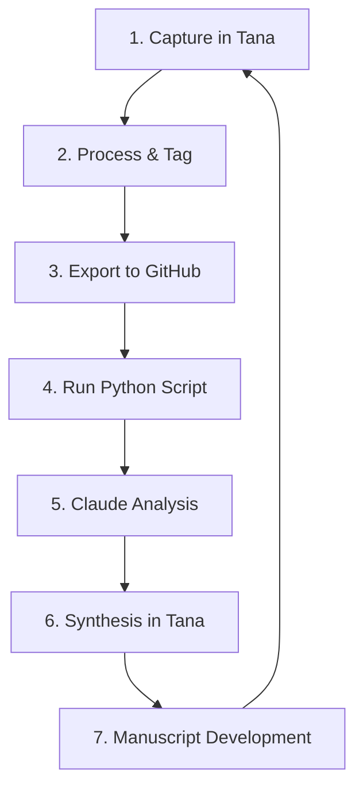

# Tana-Claude-GitHub Workflow Guide

This document details a comprehensive workflow that integrates Tana (for knowledge management), Claude (for analysis), and GitHub (for storage and version control) to support your research and writing process for the MAGA Christianism project.

## Daily Workflow Overview



## Phase 1: Capturing and Processing in Tana

### Initial Capture

1. **Import highlights from Readwise**
   - Import your Readwise highlights into Tana
   - Organize them under the appropriate book/source node

2. **Create a structural outline**
   - Create a node for the book/source
   - Add the `#Inspectional_Reading` tag
   - Create a **Structural Order** field that outlines the book's structure
   - Include an **Atomic Description** field summarizing the core thesis

### Processing with Supertags

For each highlight or note you're working with:

| Supertag | When to Use | Purpose |
|----------|-------------|---------|
| `#atomic_note_-_SN(A)CK` | When capturing initial observations from a source | Records your first reactions and connections |
| `#synthesis_note_-_SN(A)CK` | When connecting ideas across multiple sources | Develops themes that span different materials |
| `#permanent_note_-_SN(A)CK` | When creating polished, standalone insights | Forms the building blocks of your manuscript |

#### Atomic Note Process
1. Select a highlight that resonates with your research
2. Create a node beneath it
3. Write your observation and add the `#atomic_note_-_SN(A)CK` tag
4. Add relevant **Related Knowledge** connections
5. Consider adding **Related Questions** to prompt further exploration

#### Synthesis Note Process
1. Review multiple atomic notes that share thematic connections
2. Create a new node in your thematic collections area
3. Write a synthesis that connects these ideas and add the `#synthesis_note_-_SN(A)CK` tag
4. Link to the original atomic notes
5. Add relevant **Related Knowledge** connections

#### Permanent Note Process
1. Develop your synthesis notes into more polished, standalone insights
2. Create a node in your permanent notes collection
3. Write a clear, concise statement of your insight and add the `#permanent_note_-_SN(A)CK` tag
4. Ensure it can stand alone while maintaining links to supporting materials
5. These notes will form the backbone of your manuscript sections

## Phase 2: From Tana to GitHub

### Export Process

1. **Prepare Tana export**
   - Navigate to the book/source node in Tana
   - Use the export function to export as Markdown
   - Save with a consistent naming convention: `[book-name]-[date].md`
   - Place in the `sources/tana-exports/` directory

2. **Run the integration script**
   ```bash
   python3 tools/scripts/tana_readwise_integration.py \
     --readwise-file "sources/books/[Book Name].md" \
     --tana-file sources/tana-exports/[book-name]-[date].md \
     --output-dir synthesis/source-summaries/[book-name]
   ```

3. **Verify output**
   - Check the terminal output to confirm highlights and notes were extracted
   - Review the generated files in the output directory

4. **Commit to GitHub**
   - Commit your changes to keep the repository updated
   - Use descriptive commit messages that reference the source being processed

## Phase 3: Claude Analysis

### Effective Prompting Templates

#### 1. Initial Source Analysis

```
Please review my project orientation: [link to orientation.md]

I'd like you to analyze the source notes for [Book Title]: [link to GitHub folder]

Please focus on:
1. Key themes and arguments from the author
2. Connections to my MAGA Christianism research, especially regarding [specific aspect]
3. Potential gaps or areas for deeper exploration
4. How this source relates to others I've analyzed, particularly [related sources]
```

#### 2. Thematic Synthesis

```
Please review my project orientation: [link to orientation.md]

I'm developing the theme of [specific theme] across multiple sources:
- [Source 1]: [link]
- [Source 2]: [link]
- [Source 3]: [link]

Please analyze how these sources converge and diverge on this theme, with particular attention to:
1. Common patterns and contradictions
2. Historical developments of this theme
3. How this theme connects to my broader research questions about MAGA Christianism
4. Suggestions for additional areas to explore
```

#### 3. Manuscript Development

```
Please review my project orientation: [link to orientation.md]

I'm drafting Chapter [X] on [topic]. I've gathered these source materials:
- [Source materials links]

Based on my notes and highlights, please help me:
1. Identify the strongest narrative thread for this chapter
2. Suggest a potential structure that balances storytelling and analysis
3. Highlight the most compelling evidence and examples
4. Identify potential counterarguments I should address
```

#### 4. Gap Analysis

```
Please review my project orientation: [link to orientation.md]

I've analyzed these sources on [specific topic]:
- [Source list with links]

Please help me identify:
1. Significant gaps or unanswered questions in my current research
2. Potential contradictions or tensions between different sources
3. Areas where my atomic notes lack sufficient synthesis
4. Recommended next steps for deepening my understanding
```

## Phase 4: Integrating Claude's Analysis Back into Tana

1. **Create new synthesis nodes**
   - Import Claude's analysis as new nodes in Tana
   - Tag with `#claude_analysis` for easy reference

2. **Link to relevant materials**
   - Connect Claude's insights to your existing atomic and synthesis notes
   - Create new **Related Knowledge** connections

3. **Develop new permanent notes**
   - Use Claude's analysis to refine your thinking
   - Create new permanent notes that incorporate these insights
   - Tag with `#permanent_note_-_SN(A)CK`

4. **Update your consolidated synthesis**
   - Periodically update your consolidated synthesis document
   - Add new themes and connections that have emerged

## Recommended Weekly Routine

### Monday: Source Processing
- Import new highlights from Readwise
- Create atomic notes on new material
- Export to GitHub and run integration script

### Tuesday: Initial Analysis
- Prompt Claude for analysis of new source materials
- Review Claude's insights and identify key themes

### Wednesday: Synthesis Development
- Create synthesis notes connecting new insights with existing themes
- Update thematic collections

### Thursday: Gap Analysis
- Ask Claude to identify gaps and suggest new directions
- Plan additional research based on these suggestions

### Friday: Manuscript Development
- Develop permanent notes based on the week's insights
- Work on manuscript sections guided by these notes
- Export updated Tana notes to GitHub

## Special Considerations

### When to Use Each Type of Claude Prompt

- **Initial Source Analysis**: When you've just processed a new source and want to understand its relevance to your project
- **Thematic Synthesis**: When you've accumulated multiple sources on a theme and need to see patterns
- **Manuscript Development**: When you're ready to convert your notes into draft content
- **Gap Analysis**: When you feel stuck or uncertain about next steps

### Managing Large Repositories of Notes

- Regularly update your consolidated synthesis document
- Use Claude to help identify connections you might have missed
- Create periodic "state of the research" summaries to maintain perspective
- Consider using temporal tags (Q1-2023, Q2-2023, etc.) to track how your thinking evolves

### Troubleshooting Common Issues

- **Too many highlights**: Ask Claude to help identify the most relevant ones for your specific research questions
- **Difficulty creating synthesis**: Use the gap analysis prompt to identify where connections might exist
- **Script extraction issues**: Check that your Tana note formatting matches the expected patterns
- **Staying focused**: Regularly review your project orientation and use it to guide Claude's analysis

## Conclusion

This workflow integrates Tana's knowledge management capabilities, Claude's analytical strengths, and GitHub's storage and version control to create a powerful research and writing system. By following these processes, you'll be able to move efficiently from initial reading and note-taking to sophisticated analysis and manuscript development.

The key is maintaining consistency in your tagging and organization while using Claude strategically to enhance your thinking rather than replace it. Claude works best when analyzing well-structured notes and providing connections you might have missed, while Tana excels at capturing and organizing your evolving understanding.
